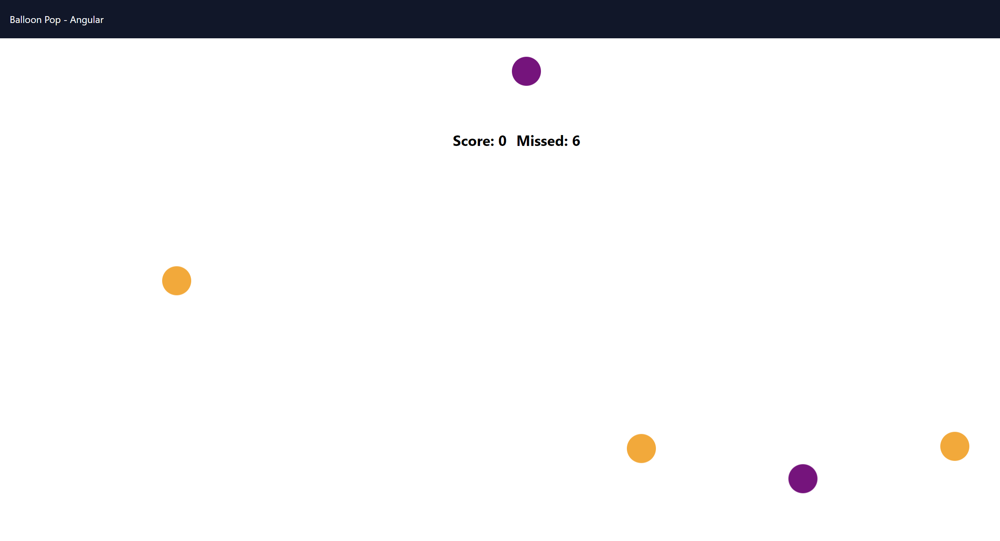

# Balloon Popping Game

- This project is an balloon pop game app and it is made with the intention of learning Angular.

## How to check via  server

- You should run `ng serve` on the terminal and go to `http://localhost:4200/` 

## How to clone this repository?

- This command link is for cloning the project files to your computer:

   git clone  https://github.com/ipekyilmaz35/Balloon-popping-game-with-Angular.git

## Sample Screen Appearance

